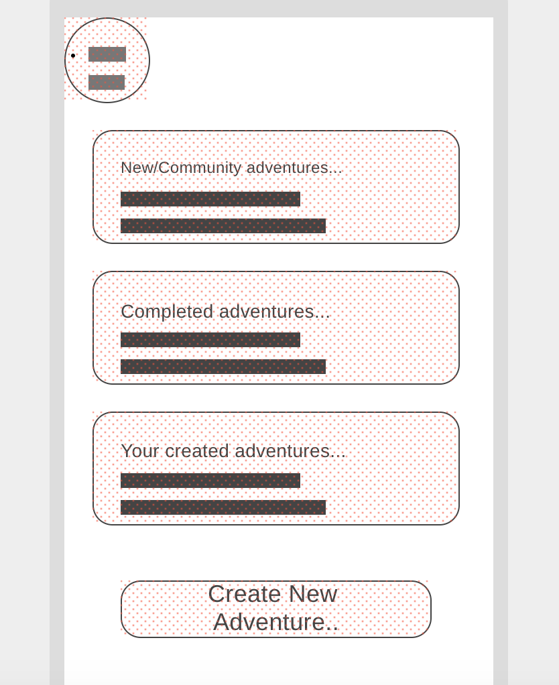
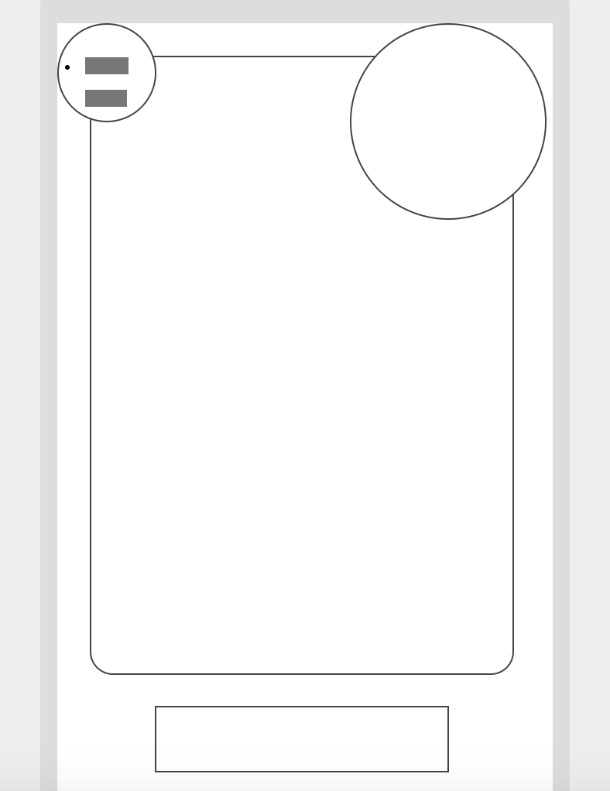
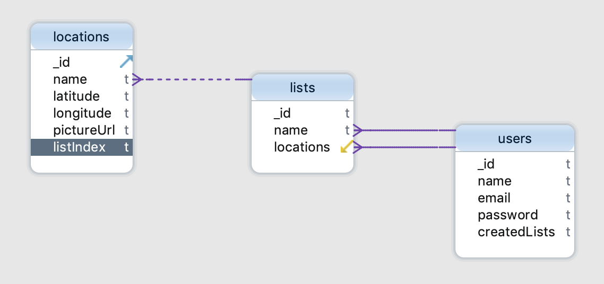

# Scavenger Hunt

Grab you friends, go on a location-based scavenger hunt around Seattle!

## Resources

### APIs
- [Cloudinary](https://cloudinary.com/)
- [Mapbox GL](https://docs.mapbox.com/mapbox-gl-js/api/)

### Libraries Used
- Node.js
- Express
- React
- Bootstrap

### Dependencies
React-mapbox-gl, axios, mongoose...
For a complete list, please see the package.json.

### Additional Resources
- [Font Awesome](https://fontawesome.com/) for nearly all icons.

## Design

#### Profile Page

#### Adventure Page

### Models

## API Routes

|METHOD| ROUTE| FUNCTION|
|:-----|:----:|:------:|
| GET   | `/lists` | `get all lists in database` |
| GET   | `/lists/:id` | `get one list and all locations` |
| GET   | `/users/:id` | `get all lists associated with the user` |
| POST  | `/lists` | `update the name of a list` |
| POST  | `/:id/lists` | `create a list associated with the user` |
| POST  | `/lists/:id/locations` | `post a location in a list` |
| DELETE | `/:uid/lists/:lid` | `delete a list, both from the user and database` |

